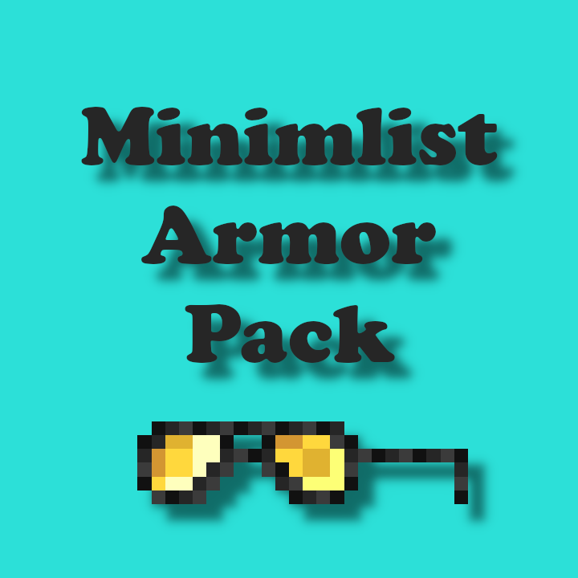
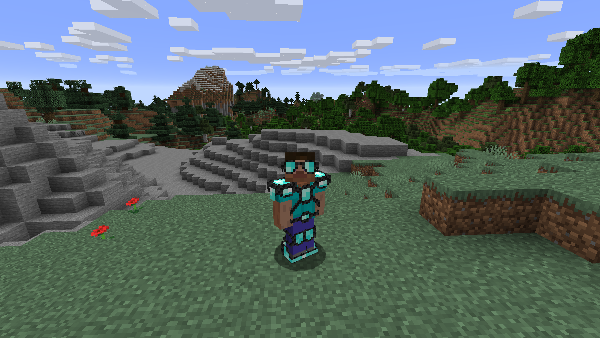

# Minimalist Armor Pack

The pack that allows you to see your skin though your armor. Mostly.

Comes with unique textures for all types of armor.

---
# Table of Contents

- [Minimalist Armor Pack](#minimlist-armor-pack)
- [Table of Contents](#table-of-contents)
  - [Current Progress](#current-progress)
    - [Diamond Armor](#diamond-armor)
- [Contributors](#contributors)
  - [Compresser (`Scripts/compress.py`)](#compresser-scriptscompresspy)

## Current Progress

- [x] Diamond
- [x] Gold
- [ ] Iron
- [ ] Leather
- [ ] Netherite
- [ ] Piglin Leather
- [ ] Turtle
- [ ] Chainmail

### Diamond Armor

# Contributors
For the people who wish to add to the project, feel free to use the following tools to help speed up the process.

## Compresser (`Scripts/compress.py`)
- Compresses assets to a zip file
- Sends compressed file to `/out`
- Requires 7zip
- Requires Python
- Requires Windows (I think)
