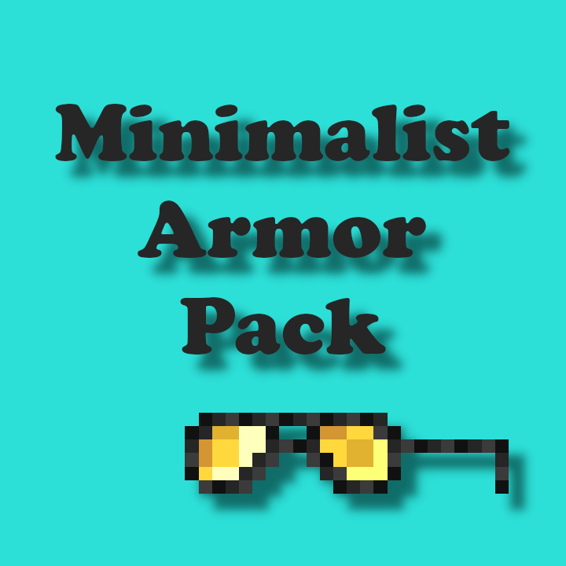

# Minimalist Armor Pack

---
# Table of Contents

- [Minimalist Armor Pack](#minimalist-armor-pack)
- [Table of Contents](#table-of-contents)
- [Requirements](#requirements)
- [Description](#description)
  - [Current Progress](#current-progress)
    - [Iron Armor](#iron-armor)
    - [Gold Armor](#gold-armor)
    - [Diamond Armor](#diamond-armor)
    - [Netherite Armor](#netherite-armor)
- [Contributors](#contributors)
  - [Compresser (`Scripts/compress.py`)](#compresser-scriptscompresspy)

# Requirements
- Optifine
- Shaders Optional, but recommended

# Description
The Minimalist Armor Pack is designed to allow others to see your skin, while also showing what armor you are wearing.

Rather than getting rid of all of the armor textures, I have decied to design and create new textures for the existing Minecraft armor.

This resource pack does require Optifine, as it uses PBR. You do not need to use a shader pack with it, however doing so does make it look awesome!

Each set of armor when in use with a shader pack, will either shine in the light with a mirror finish, or glow in the dark.

## Current Progress

- [x] Diamond
- [x] Gold
- [x] Iron
- [x] Netherite
- [ ] Leather
- [ ] Piglin Leather
- [ ] Turtle
- [ ] Chainmail

### Iron Armor

### Gold Armor

### Diamond Armor

### Netherite Armor

# Contributors
For the people who wish to add to the project, feel free to use the following tools to help speed up the process.

## Compresser (`Scripts/compress.py`)
- Compresses assets to a zip file
- Sends compressed file to `/out`
- Requires 7zip
- Requires Python
- Requires Windows (I think)
